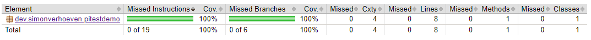
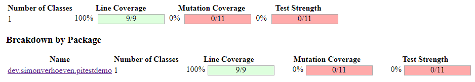
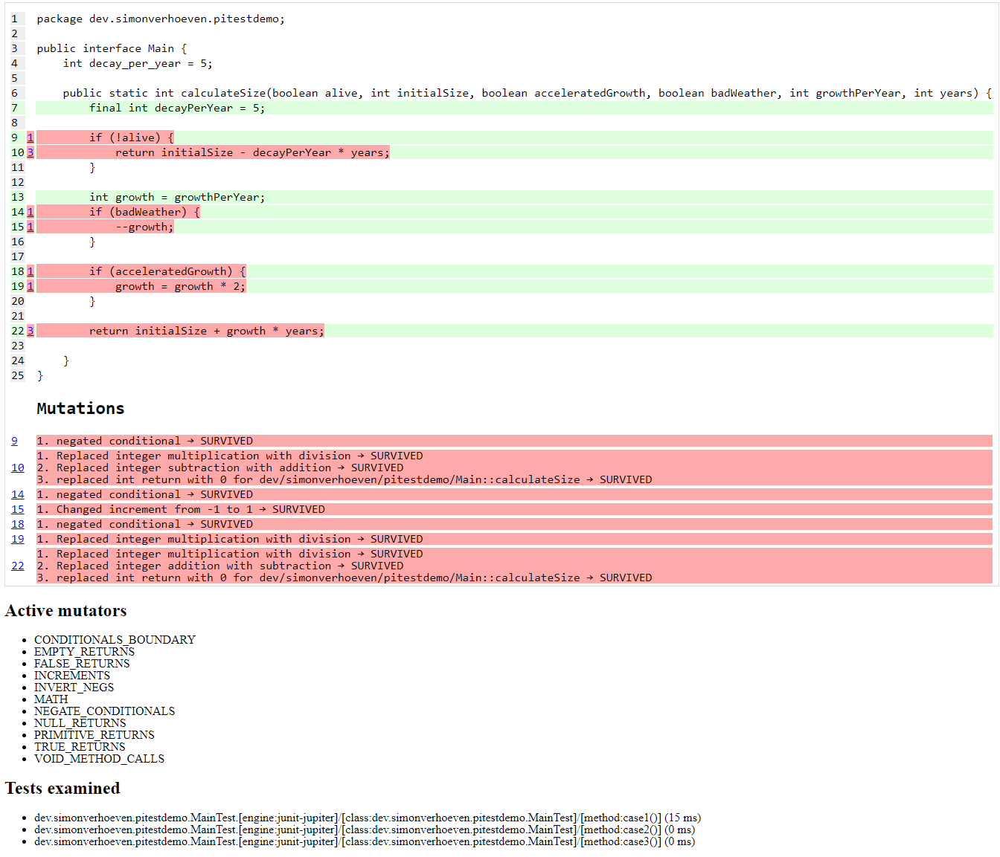
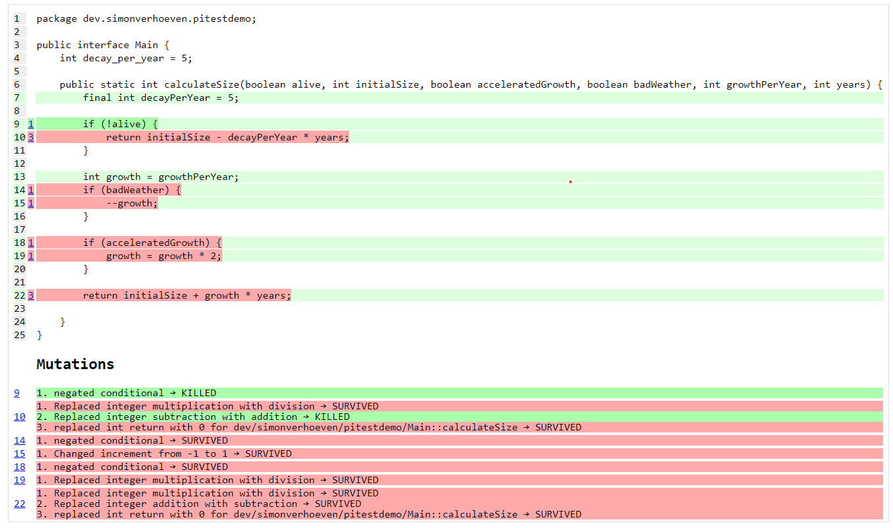
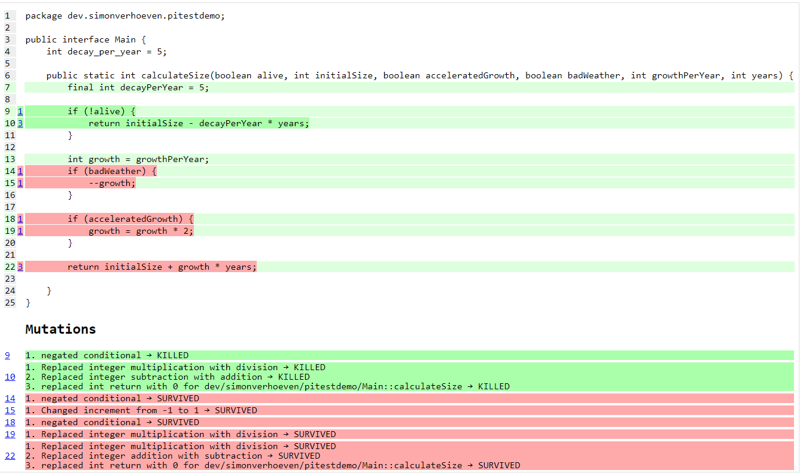
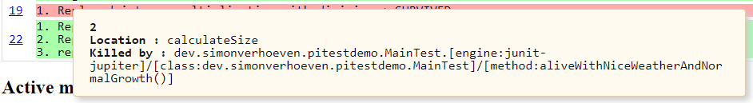
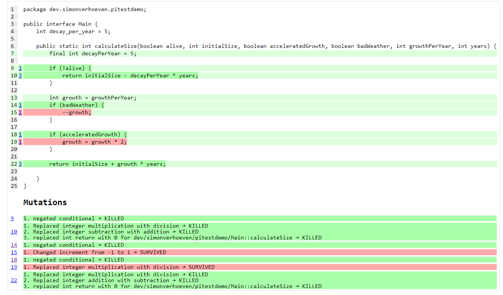

= Pitest - demo
:toc:
:toc-placement:

== What is Pitest?

Pitest is a library that helps us do mutation testing, and thus helps us get a measure of the quality of our tests.
It works by randomly seeding variations (aka mutants) in the code that's being tested.
Hence, our tests will run against variants of the code we're intending to test.
If the test fails, the mutation is killed, if it still passes it lives.

Surviving mutations may indicate issues with our test set, since application code changes should lead to different end results, and thus to failing tests.
So to further reduce the survivors we will need to enhance our testcases and/or add extra ones.

In other words, Pitest helps you assess the *quality* of your test suite.

Mutations can take a lot of forms, relational operators being switched around, increments becoming decrements, calls to void methods being removed, ...

A full list can be found on the https://pitest.org/quickstart/mutators/[Pitest Mutator Overview Page]

== Ok, but why should I use it?

The question we have to ask ourselves is: `Who watches the watchmen?`

By default, coverage reports give us information on what code is (not) tested, but no indication on whether our tests are actually able to detect issues properly.

After all, who here hasn't seen a codebase where the tests contain no asserts, yet all branches are executed?
It can also help us find issues if there were gaps in our **T**est **D**riven **D**evelopment cadence.

`We test our tests`

== A short demo

Let's run `mvn test` on this project, and we'll get this magnificent jacoco project:

A line & branch coverage of 100% magnificent isn't it?
Of course if we then take a look at our link:src/test/java/dev/simonverhoeven/pitestdemo/MainTest.java[tests] the keen eyed will spot the lack of assertions.

Now of course a proper analysis tool like Sonar will point out this lack of assertions, but it's always nice to spot this sooner.

In this project a basic Pitest setup has already been done, so we can also take a look at those results at target/pit-reports/index.html.

As you can see

Things look a lot less good over here. Pitest mutated our code, and 6 out of 7 mutations survived.
If we click on the package, and then our main class, we can see which mutations were applied, where, and which survived.

Now we know which holes in our testing remain, we can work towards fixing these and after these steps we can rerun the Pitests to verify how many mutations remain alive.

For example let's add quite a (too) simplistic check for our decay:

[source,java]
----
@Test
void decays() {
    int initialSize = 100;
    int result = Main.calculateSize(false, 100, true, true, 5, 5);
    assertTrue(initialSize > result);
}
----

If we then run Pitest again, we'll already see some improvements:

However, we'll notice there are still a couple of surviving mutations.
For example the second one, which makes since given both `100 - 5 * 5` and `100 - 5 / 5` result in a number lower than than 100.

Now if we replace the above test with:

[source,java]
----
@Test
void decays() {
    boolean alive = false;
    int initialSize = 100;
    int years = 5;
    int growthPerYear = 5;
    boolean badWeather = false;
    int expected = initialSize - years * Main.decay_per_year;
    boolean acceleratedGrowth = false;

    int result = Main.calculateSize(alive, initialSize, acceleratedGrowth, badWeather, growthPerYear, years);
    assertEquals(expected, result, "The expected size, and resulting size should be equal!");
}
----

And rerun our tests we'll see that 2 more mutations have joined the choir invisible:

**Note**: hovering over a covered mutation will show you which testcase(s) have killed it:

Now if we take a look at the remaining mutations we notice we can cover a lot of mutations in one by testing our happy path:

* the two negated conditionals
* addition replaced with subtraction
* multiplication replaced with division

By adding this test case
[source, java]
----
@Test
void aliveWithNiceWeatherAndNormalGrowth() {
    boolean alive = true;
    int initialSize = 100;
    int years = 5;
    int growthPerYear = 5;
    boolean acceleratedGrowth = false;
    boolean badWeather = false;
    int expected = initialSize + years * growthPerYear;

    int result = Main.calculateSize(alive, initialSize, acceleratedGrowth, badWeather, growthPerYear, years);
    assertEquals(expected, result, "The expected size, and resulting size should be equal!");
}
----

And as we can see after our run:

In this manner we can keep eliminating the gaps in our test coverage.

== Configuration

Pitest can be quite a resource intensive plugin, so proper configuration is important.
For example you can define which code is mutated, and which tests are run using it using `targetClasses` and `targetTests` respectively.

You can define the percentage of mutations that should be eliminated using `mutationThreshold`.

== Advice

The value of mutation testing lies in the analysis and the actions taken, not its execution.

Given the resource cost it might be tempting to only run it nightly on your CI server. But it's like a tree falling in a forest. If nobody looks at the results, did the mutation tests really run?

Now of course, as documented earlier you can certainly set a target mutation score, and whilst that will help pinpoint gaps at the end, it's like a last minute scope change.
One thinks they're done, but yet not quite. It might make one grumble a bit, and add some testcases to satisfy the tool which is the wrong motivator.

It's a tool to help you receive quick feedback in your development lifecycle, not at the end.

Please run it before your code's set in stone, especially as the implications of certain mutations might help point out spots where a different approach might be a better fit.

== Frequently Asked Questions

. How can I speed up Pitest?
* Consider using slices and specific rules to target what's actually of interest to you (see for reference this https://blog.pitest.org/dont-let-your-code-dry[blogpost])
* 
* there is experimental support for https://pitest.org/quickstart/incremental_analysis/[incremental analysis]
* by making use of the https://docs.arcmutate.com/docs/accelerator.html[Arcmutate accelarator plugin]

. Are Pitests random? +
No, they're deterministic

.  How are mutants created? +
They're generated by bytecode manipulation, and held in memory (unless you use the `EXPORT` feature, and even then yhey're placed in the report directory, so no risk for accidentally releasing them)

. Do I need to use a buildtool plugin?
* No, you can use use Pitest from the command line, but using one of the build plugins is recommended, see for reference: https://pitest.org/quickstart/commandline/[command line quick start]

. What are the requirements?
* For Pitest 1.4+ you'll need Java 8 or higher, and at least JUnit or TestNG on your classpath. +
*Note*: the `pitest-junit5-plugin` plugin is needed when you're using `JUnit 5`

== References

* https://pitest.org/[Official website]
* https://www.arcmutate.com/[Arcmutate] - from the team behind Pitest, offers extra operators
* https://github.com/STAMP-project/pitest-descartes[Descartes] - a mutation plugin engine for PIT implementing extreme mutation operators
* https://research.google/pubs/pub46584/[State of Mutation Testing at Google]